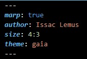
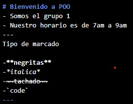
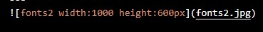

# ¿Cómo usar markdown en marp?
- **Formato Inicial**
1. La leyenda *marp* nos permite activar todas las funciones.
2. La leyenda *autor* permite guardar el nombre del autor
3. La leyenda *size* permite ajustar el tamaño de las diapositivas.
4. La leyenda *theme* permite seleccionar formatos.

5. "- - - " Se usan para marcar el inicio y el final de una diapositiva.
---

---
- **Como poner comentarios**

1. Titulos: #texto
2. Viñetas: -texto
3. Cuerpo de texto: texto
4. Negritas: * * texto * *
5. Italica: * texto *
6. Tachado: ~ ~ texto ~~
7. Resaltado: (comillaSimple) texto  (comillaSimple)

---

---

- **Como poner imagenes**

    -Sintaxis: "![nombreFoto widht:valor height:valor] ( nombreFoto )
Donde `widht` es el ancho en píxeles y `height` la altura.

    -IMPORTANTE: Para poder usar la imagen, esta debe de estar guardada en la misma ubicación que nuestro archivo .md

 
